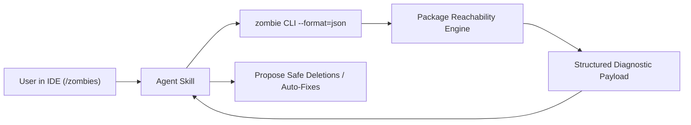

# Product Requirements Document (PRD): `pkg:zombie`

## 1. Executive Summary & Vision

**Mission**: Provide a fast, token-efficient, deterministic tool to detect and eliminate **"zombie code"** across Dart packages.

For the exact classification rules, definitions, and code examples, see [taxonomy.md](taxonomy.md).

---

## 2. User Scenarios & Personas

### 2.1 Primary User Flow: Agent-First (`/zombies`)
* **Trigger**: Developer types `/zombies` (or runs the `zombie` skill) in their IDE agent (Jetski, Claude Code, Gemini CLI, Cursor).
* **Execution**: The agent invokes the `zombie` CLI against the target codebase.
* **Token Efficiency**: The tool returns a structured, minimal-token representation so the agent can quickly inspect findings, propose deletions/refactors, and remediate dead code without blowing context limits.
* **Output Modes**:
  * **JSON (`--format=json`)**: Machine-readable structured payload for agent parsing and programmatic workflows.
  * **Markdown (`--format=markdown` / `github`)**: Scannable, human-readable tables with clickable file links and line numbers.



---

## 3. Target Scoping & Directory Invariants

### 3.1 Package Directory Topologies & Roots

`pkg:zombie` indexes and traverses the complete standard Dart package layout:

<!-- mdformat off(prevent table wrapping) -->
| Directory | Role in Reachability Graph | Root Definition & Invariant |
| :--- | :--- | :--- |
| **`lib/*.dart`** | **Public API Interface** | All exported symbols (`libraryElement.exportNamespace.definedNames`) are **Public API Roots**. |
| **`lib/src/`** | **Internal Implementation** | Not roots. Declarations are live **only** if reached from public exports, executables, tests, tools, or examples. |
| **`bin/*.dart`** | **CLIs & Executables** | Top-level `main()` functions are **Executable Roots**. |
| **`test/`** | **Unit & Integration Tests** | Test files containing `main()` are **Test Roots**. |
| **`example/`** | **Sample Apps & Demos** | Sample scripts/apps containing `main()` are **Example Roots**. |
| **`tool/`** | **Developer Utilities & Codegen** | Build/dev scripts containing `main()` are **Tool Roots**. |
| **`benchmark/` / `web/`** | **Performance & Web Entrypoints** | Entrypoint scripts containing `main()` are **Auxiliary Roots**. |
<!-- mdformat on -->

---

### 3.2 Target Scoping Modes

<!-- mdformat off(prevent table wrapping) -->
| Priority | Target Scenario | Scope Description | Analysis Boundaries |
| :--- | :--- | :--- | :--- |
| **P0 (MVP / Core)** | **Single Leaf Package** | Directory containing a single `pubspec.yaml`. | Analyzes reachability from public export roots (`lib/*.dart`) and auxiliary roots (`bin/`, `test/`, `example/`, `tool/`) down to `lib/src/`. |
| **P1 (Workspace Batch)** | **Workspace Batch Mode** | Iterates over all packages defined in a `pubspec.yaml` `workspace: [...]` or Melos. | Runs P0 analysis on each member package independently in a single command invocation. |
| **P2 (Workspace Graph)** | **Closed Workspace Cross-Package Analysis** | Treats the entire workspace/monorepo as a single closed universe. | Analyzes whether exported symbols in internal shared/utility packages (e.g. `packages/shared_utils`) are actually consumed by any sibling package in the workspace. |
| **Non-Goal** | **Single File Analysis** | Running on an isolated `foo.dart`. | **Excluded**: Single-file scope cannot soundly prove package-wide reachability. |
| **Non-Goal** | **Arbitrary Directory** | Non-package source trees (e.g. raw SDK source folders). | **Excluded**: Dart package topology (`pubspec.yaml`, `lib/`, `bin/`, `test/`, `example/`, `tool/`) is a required invariant. |
<!-- mdformat on -->

---

## 4. Output Data Models

### 4.1 JSON Output Model (Agent & Tooling)
Designed for low token overhead and actionable precision, including orphan test sites:

```json
{
  "version": "0.1.0",
  "package": "my_package",
  "summary": {
    "total_declarations": 142,
    "pure_zombies_found": 2,
    "tested_zombies_found": 1
  },
  "zombies": [
    {
      "id": "MyHelperClass.unusedMethod",
      "name": "unusedMethod",
      "kind": "method",
      "file": "lib/src/helpers/my_helper.dart",
      "line": 45,
      "column": 3,
      "length": 12,
      "classification": "pure_zombie",
      "suggested_action": "delete"
    },
    {
      "id": "OldParser",
      "name": "OldParser",
      "kind": "class",
      "file": "lib/src/old_parser.dart",
      "line": 10,
      "column": 7,
      "length": 9,
      "classification": "tested_zombie",
      "suggested_action": "delete_with_orphan_tests",
      "orphan_tests": [
        {
          "file": "test/old_parser_test.dart",
          "line": 3,
          "column": 3,
          "description": "OldParser parses correctly"
        }
      ]
    }
  ]
}
```

### 4.2 Markdown Output Model (Human / Reviewer)
* High-level summary of total scanned declarations vs zombies found.
* Categorized tables:
  * **Pure Zombies** (Safe to delete).
  * **Tested Zombies & Orphan Tests** (Delete implementation + delete associated unit test blocks).

---

## 5. Next Planning Dimensions (Backlog for Discussion)

1. **Remediation Automation**: Safe deletion AST rewrite mechanics (e.g. `--fix` / `--remove`).
2. **CLI Flags & Configuration**: `--format=json|markdown`, `--include-tools`, `--ignore-tests`.
3. **Baseline File Support**: `.zombie_baseline.json` for incremental CI ratchet.
