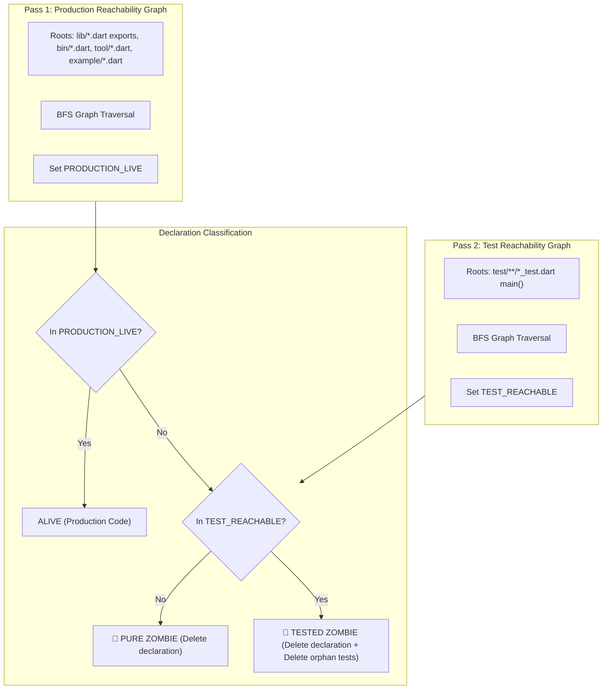

# `pkg:zombie`: Definition, Taxonomy & Example Code

## 1. Core Definition of Zombie Code

A declaration (class, method, field, getter/setter, top-level function, enum, enum value, extension, type alias) is a **Zombie** if it has public Dart visibility (no leading `_`) but is:

1. **Unexported**: Not exported directly or transitively by any public package entry point (`lib/*.dart`).
2. **Unreached in Production**: Never referenced anywhere across production roots (`lib/`, `bin/`, `tool/`, `example/`, `benchmark/`, `web/`).
3. **Unannotated**: Not annotated with entrypoint tags (`@pragma('vm:entry-point')`, `@Preview`, `@JS`).

---

## 2. Classification Matrix

<!-- mdformat off(prevent table wrapping) -->
| Scenario / Code Pattern | Location | Exported in `lib/*.dart`? | Reachable from `lib/`, `bin/`, `tool/`, `example/`? | Reachable from `test/`? | Classification | Recommended Action |
| :--- | :--- | :---: | :---: | :---: | :--- | :--- |
| **Unexported Top-Level Declaration** | `lib/src/` | ❌ No | ❌ No | ❌ No | **Pure Zombie** | Delete declaration |
| **Unused Member on Internal Class** | `lib/src/` | ❌ No | ❌ No | ❌ No | **Pure Zombie** | Delete member |
| **Unused Enum Constant** | `lib/src/` | ❌ No | ❌ No | ❌ No | **Pure Zombie** | Delete enum constant |
| **Tested Zombie (Test-Only Usage)** | `lib/src/` | ❌ No | ❌ No | ✅ Yes | **Tested Zombie** | **Delete declaration AND remove orphan test blocks** |
| **Unused Public Member on Exported Class** | `lib/` or `lib/src/` | ✅ Yes | ❌ No | ❌ No | **Public API** (Not Zombie) | Preserve (external consumer contract) |
| **Tool / Example Only Usage** | `lib/src/` | ❌ No | ✅ Yes | N/A | **Tool/Example Live** | Preserve |
| **Unused Declaration inside `tool/` or `example/`** | `tool/` or `example/` | ❌ No | ❌ No | ❌ No | **Zombie** | Delete declaration |
| **Polymorphic / Protocol Override** (`toJson`, `toString`, `==`, interface method) | `lib/src/` | ❌ No | ❌ No | ❌ No | **Exempt / Alive** | Preserve |
| **Annotated Entrypoint** (`@pragma('vm:entry-point')`, `@Preview`, `@JS`) | Any | ❌ No | ❌ No | ❌ No | **Exempt / Alive** | Preserve |
| **Suppressed via Custom Comment** | Any | ❌ No | ❌ No | ❌ No | **Ignored** | Skip |
<!-- mdformat on -->

---

## 3. Dual-Pass Reachability Engine



---

## 4. Concrete Examples & Test Cases

### Example 1: Dead Unexported Top-Level Function (Pure Zombie)
```dart
// lib/src/utils.dart (NOT exported in lib/my_package.dart)
String calculateLegacyHash(String input) => input.trim(); // 🧟 PURE ZOMBIE
```
* **Analysis**: `calculateLegacyHash` is not in `lib/*.dart` export namespace and has 0 inbound reference edges from any file in the package.
* **Remediation**: Delete `calculateLegacyHash`.

---

### Example 2: Tested Zombie (Dead Production Logic + Dead Unit Test)
```dart
// lib/src/old_parser.dart (NOT exported in lib/my_package.dart)
class OldParser {
  String parse(String raw) => raw.toLowerCase(); // 🧟 TESTED ZOMBIE: 0 production callers!
}

// test/old_parser_test.dart
void main() {
  test('OldParser parses correctly', () {
    final parser = OldParser();
    expect(parser.parse('FOO'), 'foo'); // ⚠️ ORPHAN TEST
  });
}
```
* **Analysis**: `OldParser` is unexported and has 0 callers in `lib/`, `bin/`, `tool/`, `example/`. It is invoked only in `test/old_parser_test.dart`.
* **Remediation**:
  1. Flag `OldParser` as `tested_zombie`.
  2. Identify orphan test call site: `test/old_parser_test.dart:3:3` (`test('OldParser parses correctly', ...)`).
  3. Delete `OldParser` from `lib/src/old_parser.dart` AND delete the corresponding `test(...)` block from `test/old_parser_test.dart`.

---

### Example 3: Dead Public Method on Internal Helper Class (Pure Zombie)
```dart
// lib/src/service_helper.dart (NOT exported in lib/my_package.dart)
class ServiceHelper {
  void executeActiveTask() {} // Called by lib/src/service.dart (ALIVE)
  void legacyRetryHook() {}   // 🧟 PURE ZOMBIE: Never called anywhere in package
}
```
* **Analysis**: `ServiceHelper` is instantiated and `executeActiveTask` is reachable, but `legacyRetryHook` has 0 reference edges.
* **Remediation**: Delete `legacyRetryHook`.

---

### Example 4: Public Member on Exported Class (Protected Public API)
```dart
// lib/src/client.dart (Exported via `export 'src/client.dart'` in lib/my_package.dart)
class MyClient {
  void connect() {}    // Used internally
  void disconnect() {} // Not used inside the package, but part of public API
}
```
* **Analysis**: In an open package, `MyClient` is re-exported at `lib/my_package.dart`. All public members on `MyClient` form the external public contract.
* **Remediation**: Do NOT flag as Zombie.

---

### Example 5: Tool / Example Only Usage (Tool-Live)
```dart
// lib/src/generator_config.dart (NOT exported in lib/my_package.dart)
class GeneratorConfig {
  static const defaultOutputDir = 'build/generated'; // Used ONLY in tool/generate.dart
}
```
* **Analysis**: Unexported, but referenced by a script in `tool/generate.dart`.
* **Remediation**: Preserve (Tool-Live).

---

### Example 6: Dynamic Protocol Hook (Exempt)
```dart
// lib/src/payload.dart (NOT exported)
class Payload {
  Map<String, dynamic> toJson() => {}; // 🛡️ EXEMPT: Invoked dynamically by jsonEncode()
}
```
* **Analysis**: Recognized protocol convention (`toJson`, `toString`, `==`, `hashCode`, `compareTo`).
* **Remediation**: Preserve.

---

## 5. Custom Comment Suppression Syntax

> [!IMPORTANT]
> **Anti-Collision Rule**: We must **NOT** co-opt Dart's standard `// ignore: ...` or `// ignore_for_file: ...` syntax.
> The Dart analyzer treats unrecognized lint codes in `// ignore:` as diagnostic errors (`unrecognized_error_code`).

<!-- mdformat off(prevent table wrapping) -->
| Directive | Scope | Example Usage |
| :--- | :--- | :--- |
| `// zombie:ignore` | Suppresses the immediately following declaration or member | `// zombie:ignore`<br>`void dynamicDispatchTarget() {}` |
| `// zombie:ignore_for_file` | Suppresses all zombie findings within the current `.dart` file | Top of file:<br>`// zombie:ignore_for_file` |
| `// zombie:ignore_for_class` | Suppresses all zombie findings on members within the annotated class | `// zombie:ignore_for_class`<br>`class ReflectiveContainer { ... }` |
<!-- mdformat on -->
